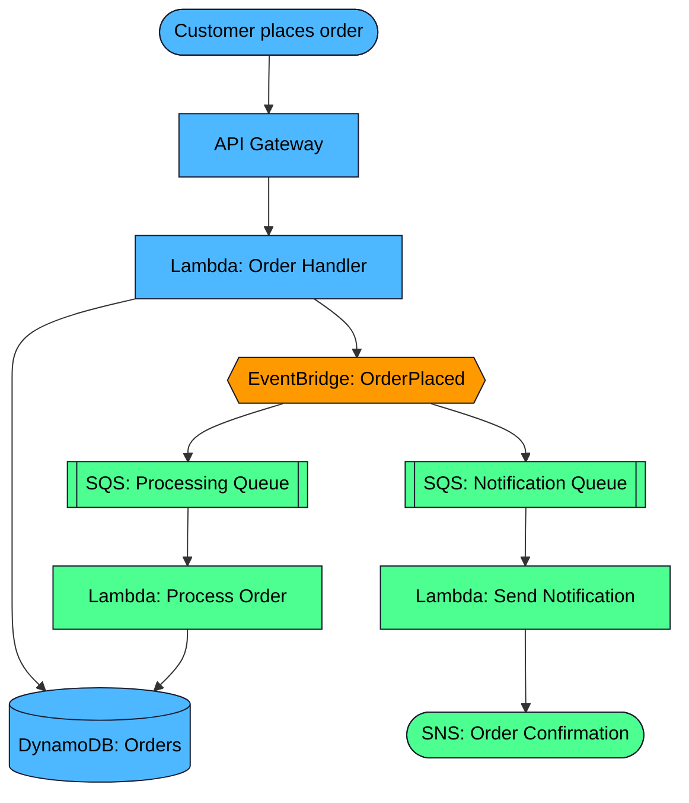
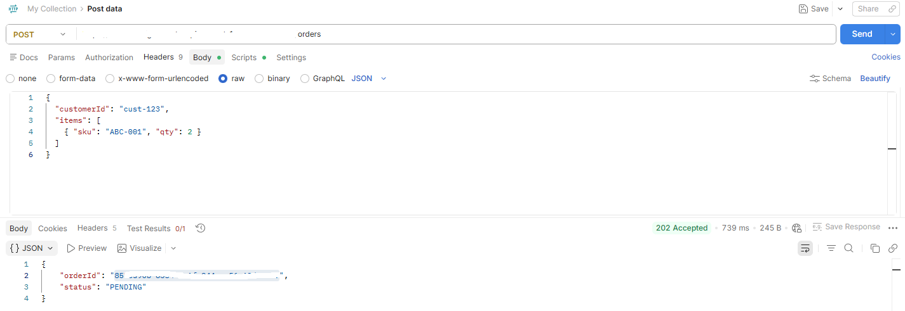

# Event-Driven E-Commerce Order Pipeline on AWS


A fully serverless, event-driven order processing pipeline built to deepen my
hands-on understanding of event-driven architecture on AWS — ahead of AWS
Solutions Architect interviews. Every service below was deployed and tested
against a live account, not just diagrammed.

## Architecture


## Proof it works

**Order status flips from PENDING to PROCESSED in DynamoDB:**


**Confirmation email delivered via SNS:**


**Lambda executing cleanly, visible in CloudWatch Logs:**


**EventBridge rule fanning out to both SQS queues:**


**Sample request and response via Postman:**

**The core idea:** the customer only waits on the fast, synchronous part
(writing the order and getting an acknowledgment back). Everything else —
processing and notifying — happens asynchronously via EventBridge fanning
out to independent SQS-backed consumers, so a slow or failing downstream
service never blocks checkout.

## How it works

1. Customer submits an order via **API Gateway** (`POST /orders`)
2. The **Order Handler Lambda** writes the order to **DynamoDB** with status
   `PENDING`, then publishes an `OrderPlaced` event to **EventBridge**, and
   immediately returns a response — the customer never waits on anything
   downstream
3. **EventBridge** fans that single event out to two independent **SQS**
   queues, each with its own dead-letter queue for messages that fail
   repeatedly
4. **Process Order Lambda** consumes from the processing queue and updates
   the order's status in DynamoDB to `PROCESSED`
5. **Send Notification Lambda** consumes from the notification queue and
   publishes a confirmation message to **SNS**, which emails the customer

## Tech stack

| Service | Role |
|---|---|
| API Gateway | Public HTTP endpoint |
| Lambda (x3) | Order handling, processing, notification |
| DynamoDB | Order storage |
| EventBridge | Event bus / fan-out |
| SQS (+ DLQs) | Decoupling, buffering, retry/failure isolation |
| SNS | Customer notification delivery |

## Debugging notes from building this

Two real issues came up while building this — leaving them here since the
troubleshooting was as instructive as the build itself:

- **The EventBridge console wizard doesn't save a rule until you click the
  final "Create rule" button.** I navigated away mid-flow to go create the
  SQS queues first (since the console wanted a target before it would let me
  finish), and the entire in-progress rule was silently discarded — no
  warning, no draft saved. Diagnosed by tracing the failure backward: no
  Lambda logs → no messages ever reaching the queue → the rule wasn't even
  listed under Rules. Fixed by recreating the rule in a single pass, adding
  both SQS targets before clicking "Create rule."

- **SNS FIFO topics only support SQS as a subscriber protocol — not email.**
  I'd created the notification topic as FIFO by default, then couldn't
  figure out why "Email" wasn't showing up as an option in the subscription
  protocol dropdown. Recreated the topic as Standard type and email
  subscriptions worked immediately.

## Repo structure

```
order-handler/          Lambda 1 — receives order, writes to DynamoDB, publishes event
process-order/          Lambda 2 — updates order status (triggered by SQS)
send-notification/      Lambda 3 — sends SNS confirmation (triggered by SQS)
diagrams/               Architecture diagram source
eventbridge-rule-pattern.json   Event pattern used for the EventBridge rule
```

Each Lambda folder includes its code and the least-privilege IAM policy it
was deployed with (`REGION`/`ACCOUNT_ID` are placeholders — swap in your own
before deploying).

## Possible extensions

- Add a **Step Functions** orchestrator if a real payment/inventory check
  were introduced — needed to coordinate a "wait for both, then confirm or
  compensate" flow, which this simplified version doesn't require since its
  two consumers are fully independent
- **X-Ray** tracing across all three Lambdas for full request-path visibility
- **CloudWatch alarms** on each DLQ's message count to catch repeated
  failures proactively

## Testing

Tested end to end via a manual `POST /orders` request: confirmed the order
lands in DynamoDB as `PENDING`, flips to `PROCESSED` within seconds, and a
confirmation email is delivered via SNS.

```bash
curl -X POST https://YOUR-API-ID.execute-api.REGION.amazonaws.com/orders \
  -H "Content-Type: application/json" \
  -d '{"customerId": "cust-123", "items": [{"sku": "ABC-001", "qty": 2}]}'
```
