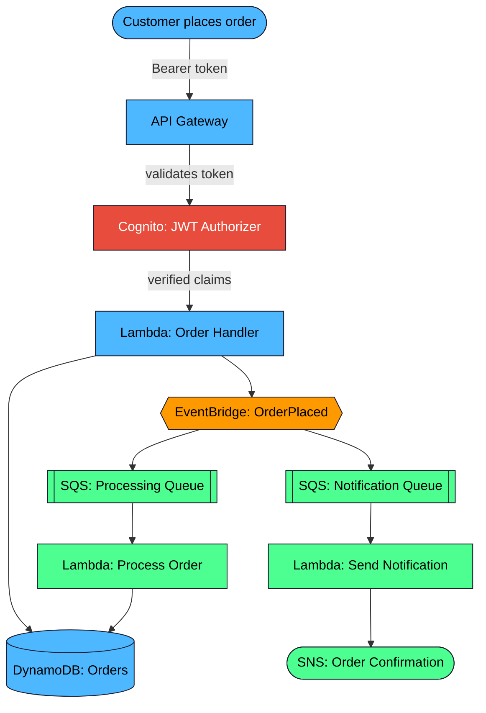

## Architecture

**The core idea:** the customer only waits on the fast, synchronous part
(writing the order and getting an acknowledgment back). Everything else —
processing and notifying — happens asynchronously via EventBridge fanning
out to independent SQS-backed consumers, so a slow or failing downstream
service never blocks checkout.